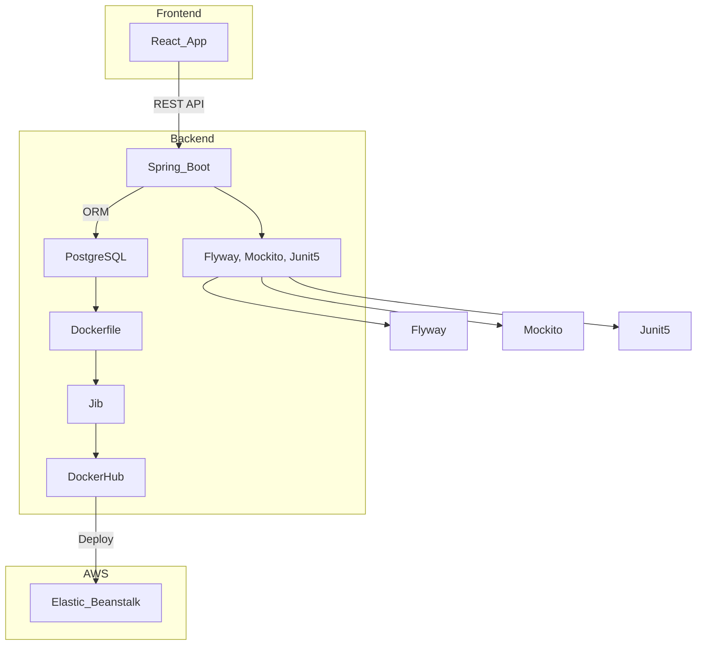

## This is the current flow of my Application

```mermaid
graph TD
    subgraph Frontend
        React_App
    end

    subgraph Backend
        Spring_Boot
        Dependencies[Flyway, Mockito, Junit5]
        Database[PostgreSQL]
        Dockerfile
        Jib
        DockerHub
    end

    subgraph AWS
        Elastic_Beanstalk
    end

    React_App -->|REST API| Spring_Boot
    Spring_Boot --> Dependencies
    Dependencies --> Flyway
    Dependencies --> Mockito
    Dependencies --> Junit5
    Spring_Boot -->|ORM| Database
    Database --> Dockerfile
    Dockerfile --> Jib
    Jib --> DockerHub
    DockerHub -->|Deploy| Elastic_Beanstalk

```
